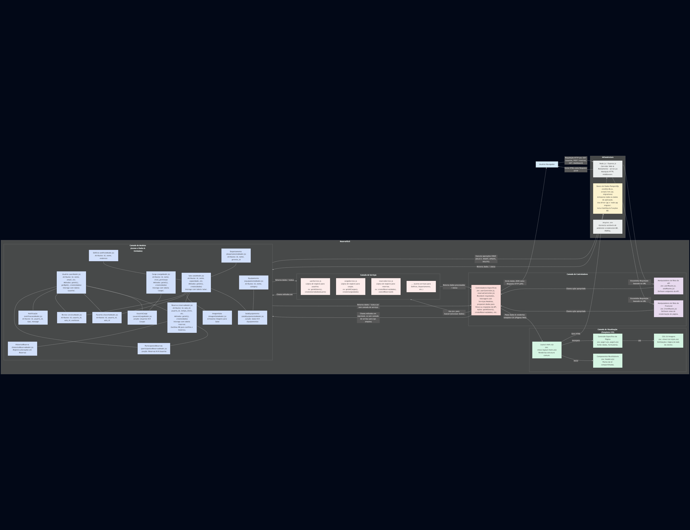
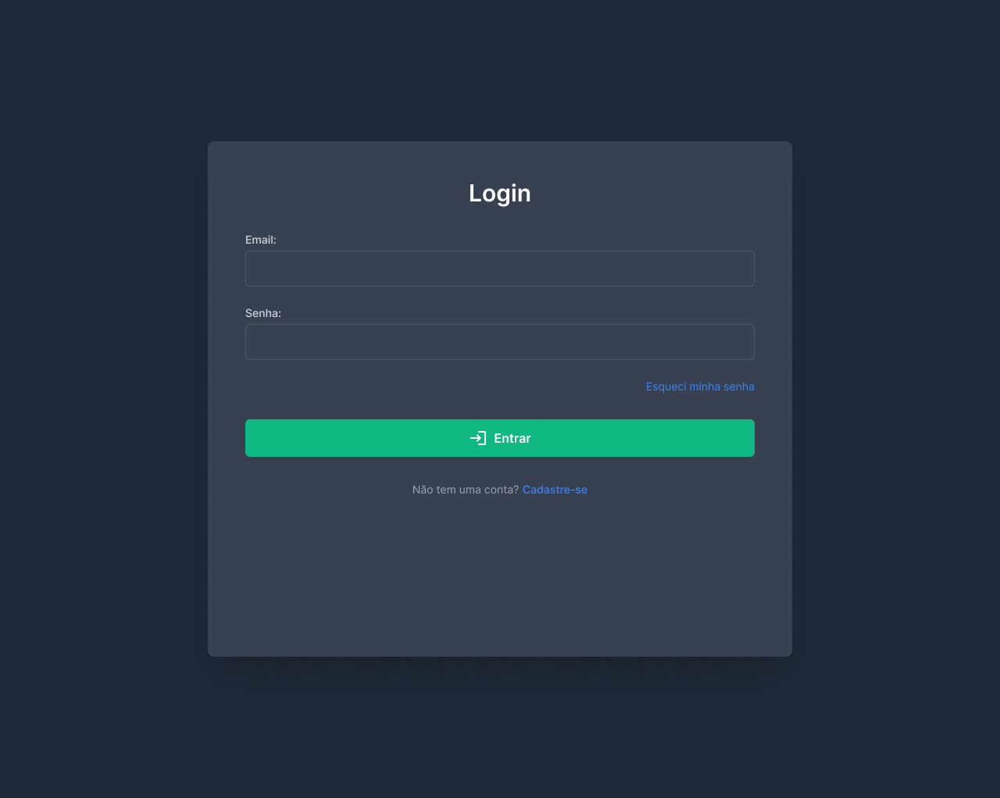

# Web Application Document - Projeto Individual - Módulo 2 - Inteli

**_Os trechos em itálico servem apenas como guia para o preenchimento da seção. Por esse motivo, não devem fazer parte da documentação final._**

## Nome do Projeto

ReservaFácil

#### Autor do projeto

Rafael Ryu Tati Nakahara

## Sumário

1. [Introdução](#c1)  
2. [Visão Geral da Aplicação Web](#c2)  
3. [Projeto Técnico da Aplicação Web](#c3)  
4. [Desenvolvimento da Aplicação Web](#c4)  
5. [Referências](#c5)  

 

## 1. Introdução

O ReservaFácil é uma aplicação web criada com o intuito de simplificar e otimizar o processo de reserva de salas em ambientes como universidades, escritórios ou espaços de coworking. Atualmente, a gestão dessas reservas é frequentemente feita de forma manual e pouco organizada, gerando conflitos de horário e perda de tempo para os usuários e administradores.

Este projeto visa solucionar esses problemas oferecendo uma plataforma centralizada e de fácil utilização. Através do ReservaFácil, usuários (como estudantes, professores ou funcionários) poderão visualizar a disponibilidade das salas em tempo real, filtrar por características (capacidade, equipamentos), realizar reservas de forma rápida e prática, e gerenciar seus próprios agendamentos. O sistema busca proporcionar eficiência e conveniência, garantindo que os espaços sejam utilizados da melhor forma possível e que os usuários tenham uma experiência de agendamento sem atritos.

---

## 2. Visão Geral da Aplicação Web

### 2.1. Personas

---
**PERSONA: Gustavo Carlos**
---

**Nome:** Gustavo Carlos

**Idade:** 18 anos

**Ocupação:** Estudante Universitário (1º ano de Veterinária)

**Hábitos Digitais:**
*   Usa smartphone e notebook diariamente para estudos, comunicação e lazer.
*   Ativo em redes sociais (Instagram, WhatsApp) para interagir com colegas/amigos, se manter informado e se entreter.
*   Acessa o portal da universidade para notas, materiais e avisos.
*   Consome conteúdo online (vídeos) relacionado aos seus estudos e hobbies.
*   Familiarizado com compras online.

**Necessidades:**
*   Encontrar salas de estudo disponíveis na universidade de forma rápida e fácil.
*   Reservar salas para estudo individual ou em grupo com antecedência.
*   Saber quais equipamentos (projetor, lousa, ar-condicionado) estão disponíveis em cada sala.
*   Evitar perder tempo procurando por salas desocupadas no campus.
*   Ter um sistema confiável para gerenciar suas reservas.

**Dores:**
*   Frustração por não encontrar salas de estudo livres, especialmente em épocas de prova.
*   Perda de tempo andando pelo campus à procura de um local para estudar.
*   Sistemas de reserva atuais (quando existem) são confusos, manuais ou inexistentes.

**Solução (Como o ReservaFácil o ajuda):**
O ReservaFácil permite que o Gustavo visualize rapidamente todas as salas disponíveis na universidade, filtre por capacidade ou equipamentos (ex: sala com projetor para ensaiar apresentações) e reserve um horário em poucos cliques, diretamente do seu celular ou computador. Ele pode planejar suas sessões de estudo e trabalhos em grupo com antecedência, garantindo um local adequado de forma prática e rápida, reduzindo seu estresse e frustração.

### 2.2. User Stories

**US01 |** Como estudante, quero visualizar a disponibilidade das salas em tempo real, para que eu possa planejar meus estudos e encontrar um local adequado rapidamente.

**US02 |** Como usuário do sistema, quero poder filtrar as salas por capacidade e tipo de equipamento (ex: projetor, lousa), para que eu encontre uma sala que atenda às minhas necessidades específicas.

**US03 |** Como estudante, quero poder reservar uma sala para um período específico, para que eu possa garantir o espaço para realizar minhas atividades acadêmicas, como estudo individual ou reuniões de grupo.

---
**Análise INVEST da User Story US01:**

**US01 | Como estudante, quero visualizar a disponibilidade das salas em tempo real, para que eu possa planejar meus estudos e encontrar um local adequado rapidamente.**

*   **I – Independente (Independent):**
    *   **Justificativa:** Esta história pode ser desenvolvida e entregue independentemente de outras funcionalidades, como o próprio ato de reservar. A visualização da disponibilidade é um valor em si, mesmo que outras interações não estejam prontas. Um usuário pode, inicialmente, apenas consultar a disponibilidade antes de se dirigir fisicamente ao local.

*   **N – Negociável (Negotiable):**
    *   **Justificativa:** Os detalhes de como a disponibilidade é exibida são negociáveis. Como será exibido, em uma lista, em um calendário? Com que nível de detalhe (apenas "ocupado/livre" ou mostrando quem reservou)?

*   **V – Valiosa (Valuable):**
    *   **Justificativa:** Esta funcionalidade entrega valor direto ao usuário (Gustavo). Resolve a dor de não saber onde há salas disponíveis, economizando tempo e reduzindo frustração. É uma das principais razões pelas quais um usuário utilizaria o sistema.

*   **E – Estimável (Estimable):**
    *   **Justificativa:** É estimar o esforço necessário para implementar essa funcionalidade. É possível quebrar em tarefas menores, como: criar a interface de visualização, conectar a um banco de dados e exibir os dados de status das salas.

*   **S – Pequena (Small):**
    *   **Justificativa:** A funcionalidade de visualizar a disponibilidade, em sua forma mais básica (ex: listar salas e seus status para o dia atual), é suficientemente pequena para ser concluída dentro de uma Sprint. Funcionalidades mais complexas de visualização (filtros avançados, visualização semanal/mensal) podem ser histórias separadas.

*   **T – Testável (Testable):**
    *   **Justificativa:** É possível definir critérios de aceitação claros e testar se a funcionalidade atende a eles. Por exemplo: "Quando o usuário acessa a tela de disponibilidade, ele vê uma lista de salas." "Salas reservadas para o horário atual devem aparecer como 'Ocupada'." "Salas livres devem aparecer como 'Disponível'."

---

## 3. Projeto da Aplicação Web

### 3.1. Modelagem do banco de dados

Para que o sistema funcione de maneira ágil e confiável – gerenciando usuários, salas, equipamentos e agendamentos em tempo real – uma estrutura de dados bem definida é essencial. A escolha por um banco de dados relacional é, assim, fundamental para garantir a integridade, organização e o acesso rápido às informações que dão vida ao ReservaFácil.

### 1. Diagrama Entidade-Relacionamento

O diagrama acima mostra a estrutura completa do banco de dados, com todas as tabelas e suas relações.

### Esquema de Banco de Dados do ReservaFácil

## Tabelas e Suas Relações

### 2. Usuários e Autenticação

#### Tabela: `usuarios`
- **Descrição**: Armazena informações dos usuários do sistema
- **Campos principais**:

- `id` (UUID, PK)
- `nome` (VARCHAR)
- `email` (VARCHAR, UNIQUE)
- `password_hash` (VARCHAR)
- `telefone` (VARCHAR)
- `imagem_perfil` (VARCHAR)
- `departamento` (VARCHAR)
- `esta_ativo` (BOOLEAN)
- `criado_em`, `atualizado_em`, `ultimo_login` (TIMESTAMP)

#### Tabela: `cargos`
- **Descrição**: Define os diferentes níveis de acesso no sistema
- **Campos principais**:

- `id` (UUID, PK)
- `nome` (VARCHAR, UNIQUE)
- `descricao` (VARCHAR)
- `nivel_permissao` (INTEGER)
- `criado_em` (TIMESTAMP)

#### Tabela: `usuario_cargos`
- **Descrição**: Relacionamento N:N entre usuários e cargos
- **Campos principais**:

- `id` (UUID, PK)
- `usuario_id` (UUID, FK → usuarios.id)
- `cargo_id` (UUID, FK → cargos.id)
- `atribuido_em`, `expira_em` (TIMESTAMP)

**Relacionamento**: Um usuário pode ter múltiplos cargos (papéis) no sistema, e cada cargo pode ser atribuído a múltiplos usuários.

### 3. Estrutura Física

#### Tabela: `edificios`
- **Descrição**: Representa os prédios onde as salas estão localizadas
- **Campos principais**:

- `id` (UUID, PK)
- `nome` (VARCHAR)
- `endereco` (VARCHAR)
- `descricao` (TEXT)
- `andar` (INTEGER)
- `horario_abertura`, `horario_fechamento` (TIME)
- `esta_ativo` (BOOLEAN)
- `criado_em` (TIMESTAMP)

#### Tabela: `departamentos`
- **Descrição**: Representa os departamentos responsáveis pelas salas
- **Campos principais**:

- `id` (UUID, PK)
- `nome` (VARCHAR)
- `descricao` (TEXT)
- `gerente_id` (UUID, FK → usuarios.id)
- `criado_em` (TIMESTAMP)

**Relacionamento**: Um departamento é gerenciado por um usuário (gerente_id).

### 4. Salas e Equipamentos

#### Tabela: `salas`
- **Descrição**: Representa os espaços que podem ser reservados
- **Campos principais**:

- `id` (UUID, PK)
- `nome` (VARCHAR)
- `construcao_id` (UUID, FK → edificios.id)
- `departamento_id` (UUID, FK → departamentos.id)
- `floor` (INTEGER)
- `capacidade` (INTEGER)
- `descricao` (TEXT)
- `tipo_sala` (VARCHAR)
- `esta_ativo` (BOOLEAN)
- `criado_em` (TIMESTAMP)

#### Tabela: `equipamento`
- **Descrição**: Representa os equipamentos disponíveis
- **Campos principais**:

- `id` (UUID, PK)
- `nome` (VARCHAR)
- `descricao` (TEXT)
- `category` (VARCHAR)
- `criado_em` (TIMESTAMP)

#### Tabela: `sala_equipamento`
- **Descrição**: Relacionamento N:N entre salas e equipamentos
- **Campos principais**:

- `id` (UUID, PK)
- `sala_id` (UUID, FK → salas.id)
- `equipamento_id` (UUID, FK → equipamento.id)
- `quantidade` (INTEGER)
- `status` (VARCHAR)
- `last_maintenance` (TIMESTAMP)

#### Tabela: `imagem_sala`
- **Descrição**: Armazena imagens das salas
- **Campos principais**:

- `id` (UUID, PK)
- `sala_id` (UUID, FK → salas.id)
- `url_imagem` (VARCHAR)
- `descricao` (VARCHAR)
- `uploaded_em` (TIMESTAMP)

**Relacionamentos**:

- Uma sala pertence a um edifício (construcao_id)
- Uma sala é gerenciada por um departamento (departamento_id)
- Uma sala pode ter múltiplos equipamentos
- Uma sala pode ter múltiplas imagens

### 5. Sistema de Reservas

#### Tabela: `reservas`
- **Descrição**: Representa as reservas de salas feitas pelos usuários
- **Campos principais**:

- `id` (UUID, PK)
- `sala_id` (UUID, FK → salas.id)
- `usuario_id` (UUID, FK → usuarios.id)
- `tempo_inicio`, `tempo_fim` (TIMESTAMP)
- `titulo` (VARCHAR)
- `descricao` (TEXT)
- `status` (VARCHAR)
- `numero_participantes` (INTEGER)
- `e_recorrente` (BOOLEAN)
- `padrao_recorrencia` (VARCHAR)
- `criado_em`, `atualizado_em`, `cancelado_em` (TIMESTAMP)

#### Tabela: `participantes_reservas`
- **Descrição**: Representa os usuários convidados para uma reserva
- **Campos principais**:

- `id` (UUID, PK)
- `reserva_id` (UUID, FK → reservas.id)
- `usuario_id` (UUID, FK → usuarios.id)
- `cargo` (VARCHAR)
- `confirmado` (BOOLEAN)
- `convidado_em`, `confirmado_em` (TIMESTAMP)

#### Tabela: `historico_reserva`
- **Descrição**: Registra alterações nas reservas
- **Campos principais**:

- `id` (UUID, PK)
- `reserva_id` (UUID, FK → reservas.id)
- `usuario_id` (UUID, FK → usuarios.id)
- `acao` (VARCHAR)
- `status_anterior`, `status_novo` (VARCHAR)
- `criado_em` (TIMESTAMP)

**Relacionamentos**:

- Uma reserva é feita para uma sala específica (sala_id)
- Uma reserva é criada por um usuário (usuario_id)
- Uma reserva pode ter múltiplos participantes
- Todas as alterações em uma reserva são registradas

### 6. Funcionalidades Sociais e Notificações

#### Tabela: `notificacoes`
- **Descrição**: Armazena notificações enviadas aos usuários
- **Campos principais**:

- `id` (UUID, PK)
- `usuario_id` (UUID, FK → usuarios.id)
- `tipo` (VARCHAR)
- `titulo` (VARCHAR)
- `message` (TEXT)
- `is_read` (BOOLEAN)
- `criado_em`, `read_em` (TIMESTAMP)

#### Tabela: `favoritos`
- **Descrição**: Armazena as salas favoritas dos usuários
- **Campos principais**:

- `id` (UUID, PK)
- `usuario_id` (UUID, FK → usuarios.id)
- `sala_id` (UUID, FK → salas.id)
- `criado_em` (TIMESTAMP)

#### Tabela: `reviews`
- **Descrição**: Armazena avaliações das salas feitas pelos usuários
- **Campos principais**:

- `id` (UUID, PK)
- `usuario_id` (UUID, FK → usuarios.id)
- `sala_id` (UUID, FK → salas.id)
- `avaliacao` (INTEGER)
- `comentario` (TEXT)
- `criado_em`, `atualizado_em` (TIMESTAMP)

**Relacionamentos**:

- Um usuário recebe notificações
- Um usuário pode favoritar múltiplas salas
- Um usuário pode avaliar múltiplas salas

## Funcionalidades Avançadas do Banco de Dados

### 1. Índices

O banco de dados utiliza índices para otimizar consultas frequentes, como:

- Busca de reservas por sala (`idx_reservas_sala_id`)
- Busca de reservas por usuário (`idx_reservas_usuario_id`)
- Busca de reservas por período (`idx_reservas_tempo_inicio`, `idx_reservas_tempo_fim`)
- Busca de salas por edifício (`idx_salas_construcao_id`)
- Busca de salas por departamento (`idx_salas_departamento_id`)
- Busca de salas por tipo (`idx_salas_tipo_sala`)

### 2. Triggers e Funções Automatizadas

#### Atualização de Timestamps
- `atualizar_atualizado_em_coluna()`: Atualiza automaticamente o campo `atualizado_em` quando um registro é modificado

#### Registro de Histórico
- `log_mudanca_reserva()`: Registra automaticamente todas as alterações em reservas na tabela `historico_reserva`

#### Verificação de Conflitos
- `checkar_conflito_reserva()`: Verifica se há conflitos de horário ao criar ou modificar uma reserva

#### Sistema de Notificações Automáticas
- `notificar_criacao_reserva()`: Envia notificação quando uma reserva é criada
- `notificar_reserva_cancelada()`: Envia notificações quando uma reserva é cancelada
- `notificar_participante_adicionado()`: Envia notificação quando um usuário é adicionado como participante de uma reserva

### 3. Constraints

O banco de dados utiliza constraints para garantir a integridade dos dados:

- Chaves estrangeiras para garantir integridade referencial
- Verificações para garantir dados válidos (ex: avaliação entre 1 e 5)
- Unicidade para evitar duplicações (ex: um usuário não pode avaliar a mesma sala duas vezes)
- Verificação de tempo (ex: tempo_fim > tempo_inicio)

### [Schema do DB](../scripts/init.sql)

### 3.1.1 BD e Models

Os models são responsáveis por interagir com o banco de dados, facilitando a manipulação dos dados. A seguir, uma descrição dos models implementados:

*   **`userModel.js`**: Gerencia os dados dos usuários, como informações de perfil, autenticação e estado da conta. Corresponde à tabela `usuarios`.
*   **`cargoModel.js`**: Define os diferentes cargos ou papéis que um usuário pode ter no sistema, controlando níveis de permissão. Corresponde à tabela `cargos`.
*   **`usuarioCargoModel.js`**: Representa a relação entre usuários e seus respectivos cargos, permitindo que um usuário tenha múltiplos papéis. Corresponde à tabela `usuario_cargos`.
*   **`edificioModel.js`**: Gerencia as informações sobre os edifícios onde as salas estão localizadas, incluindo endereço e horários de funcionamento. Corresponde à tabela `edificios`.
*   **`departamentoModel.js`**: Armazena dados dos departamentos responsáveis pelas salas ou que agrupam usuários. Corresponde à tabela `departamentos`.
*   **`salaModel.js`**: Representa as salas que podem ser reservadas, incluindo detalhes como capacidade, tipo e localização (edifício e andar). Corresponde à tabela `salas`.
*   **`equipamentoModel.js`**: Gerencia os tipos de equipamentos que podem estar disponíveis nas salas (ex: projetor, lousa). Corresponde à tabela `equipamento`.
*   **`salaEquipamentoModel.js`**: Define a relação entre salas e os equipamentos que elas contêm, incluindo quantidade e status. Corresponde à tabela `sala_equipamento`.
*   **`imagemSalaModel.js`**: Armazena URLs e descrições de imagens associadas às salas. Corresponde à tabela `imagem_sala`.
*   **`reservaModel.js`**: Gerencia as informações das reservas de salas, incluindo horários, usuário solicitante e status. Corresponde à tabela `reservas`.
*   **`participantesReservasModel.js`**: Modela os participantes convidados ou adicionados a uma reserva específica. Corresponde à tabela `participantes_reservas`.
*   **`historicoReservaModel.js`**: Registra o histórico de alterações e eventos relacionados a uma reserva. Corresponde à tabela `historico_reserva`.
*   **`notificacoesModel.js`**: Gerencia as notificações enviadas aos usuários sobre eventos no sistema (ex: confirmação de reserva). Corresponde à tabela `notificacoes`.
*   **`favoritoModel.js`**: Permite que usuários marquem salas como favoritas para fácil acesso. Corresponde à tabela `favoritos`.
*   **`reviewModel.js`**: Armazena as avaliações e comentários feitos pelos usuários sobre as salas. Corresponde à tabela `reviews`.

### 3.2. Arquitetura

A arquitetura MVC (Model-View-Controller) é um padrão de design de software utilizado para organizar aplicações. Ela divide a aplicação em três componentes principais interconectados, cada um com responsabilidades distintas:

*   **Model (Modelo):** Representa os dados e a lógica de negócios da aplicação. É responsável por acessar e manipular os dados (de um banco de dados) e por aplicar as regras de negócios. Ele não tem conhecimento direto da interface do usuário.
*   **View (Visão):** É a camada de apresentação, responsável por exibir os dados ao usuário. Ela obtém os dados do Modelo (através do Controlador) e os renderiza de forma visual. No contexto de uma aplicação web, a View é frequentemente composta por HTML, CSS e JavaScript.
*   **Controller (Controlador):** Atua como um intermediário entre o Model e a View. Ele recebe as entradas do usuário (requisições HTTP), interage com o Model para processar essas entradas e atualiza a View para refletir as mudanças ou apresentar os resultados.

Essa separação de responsabilidades promove um código mais organizado, modular e fácil de manter, além de facilitar o desenvolvimento paralelo das diferentes camadas e a reutilização de componentes.

### 3.3. Wireframes

Os wireframes a seguir representam a estrutura visual inicial. Eles foram criados para definir a disposição dos elementos nas principais telas da aplicação, focando na usabilidade e na experiência do usuário.

### Tela de Login

### Tela do Dashboard

### Tela das Minhas Reservas

### 3.4. Guia de estilos (Semana 05)

O guia de estilos é fundamental para manter a consistência visual e a identidade da marca da aplicação.

**Elementos do Guia de Estilos:**
*   **Paleta de Cores:** Define as cores primárias, secundárias e de destaque utilizadas na interface.
*   **Tipografia:** Especifica as fontes, tamanhos e pesos para diferentes elementos textuais.
*   **Componentes de UI:** Descreve o design de botões, campos de formulário, cards, e outros elementos interativos.
*   **Iconografia:** Apresenta o conjunto de ícones utilizados na aplicação.
*   **Layout e Espaçamento:** Diretrizes sobre a organização dos elementos na tela e o espaçamento entre eles.

A imagem a seguir exibe o Guia de Estilos consolidado:

### 3.5. Protótipo de alta fidelidade (Semana 05)

Estes protótipos visam simular a experiência final do usuário com a aplicação.

Os protótipos incluem as seguintes telas:

1.  **Tela de Login:** Interface para autenticação dos usuários.
    

    
    

2.  **Dashboard:** Painel principal acessado após o login, com resumo de atividades e navegação.
    

    
    

3.  **Minhas Reservas:** Área onde o usuário pode visualizar e gerenciar suas reservas de salas.
    

    
    

### 3.6. WebAPI e endpoints (Semana 5)

A WebAPI do ReservaFácil expõe os seguintes endpoints para interagir com os recursos do sistema. Todos os endpoints de API são prefixados com `/api`.

#### 1. Cargos (`/api/cargos`)
- `GET /`: Lista todos os cargos.
- `GET /:id`: Obtém um cargo específico pelo ID.
- `POST /`: Cria um novo cargo.
- `PUT /:id`: Atualiza um cargo existente pelo ID.
- `DELETE /:id`: Deleta um cargo existente pelo ID.

#### 2. Departamentos (`/api/departamentos`)
- `POST /`: Cria um novo departamento.
- `GET /`: Lista todos os departamentos.
- `GET /:id`: Obtém um departamento específico pelo ID.
- `PUT /:id`: Atualiza um departamento existente pelo ID.
- `DELETE /:id`: Deleta um departamento existente pelo ID.

#### 3. Edifícios (`/api/edificios`)
- `POST /`: Cria um novo edifício.
- `GET /`: Lista todos os edifícios.
- `GET /:id`: Obtém um edifício específico pelo ID.
- `PUT /:id`: Atualiza um edifício existente pelo ID.
- `DELETE /:id`: Deleta um edifício existente pelo ID.

#### 4. Equipamentos (`/api/equipamentos`)
- `POST /`: Cria um novo equipamento.
- `GET /`: Lista todos os equipamentos.
- `GET /:id`: Obtém um equipamento específico pelo ID.
- `PUT /:id`: Atualiza um equipamento existente pelo ID.
- `DELETE /:id`: Deleta um equipamento existente pelo ID.

#### 5. Favoritos (`/api/favoritos`)
- `POST /`: Adiciona uma sala aos favoritos de um usuário.
- `GET /`: Lista todos os favoritos.
- `GET /usuario/:usuarioId`: Lista os favoritos de um usuário específico.
- `GET /:id`: Obtém um registro de favorito específico pelo ID.
- `DELETE /:id`: Remove um favorito pelo seu ID.
- `DELETE /usuario/:usuarioId/sala/:salaId`: Remove uma sala específica dos favoritos de um usuário.

#### 6. Histórico de Reservas (`/api/historico-reservas`)
- `GET /`: Lista todos os históricos de reservas.
- `GET /:id`: Obtém um histórico de reserva específico pelo ID.
- `GET /reserva/:reservaId`: Lista o histórico de uma reserva específica.
- `POST /`: Cria um novo registro de histórico de reserva.
- `PUT /:id`: Atualiza um registro de histórico de reserva.
- `DELETE /:id`: Deleta um registro de histórico de reserva.

#### 7. Imagens de Sala (`/api/imagens-sala`)
- `POST /`: Adiciona uma nova imagem para uma sala.
- `GET /`: Lista todas as imagens de salas.
- `GET /:id`: Obtém uma imagem de sala específica pelo ID.
- `GET /sala/:sala_id`: Lista todas as imagens de uma sala específica.
- `PUT /:id`: Atualiza uma imagem de sala.
- `DELETE /:id`: Deleta uma imagem de sala.

#### 8. Notificações (`/api/notificacoes`)
- `GET /usuario/:usuarioId`: Lista as notificações de um usuário específico.
- `POST /`: Cria uma nova notificação.
- `PUT /:id/lida`: Marca uma notificação específica como lida.
- `PUT /usuario/:usuarioId/lidas`: Marca todas as notificações de um usuário como lidas.
- `DELETE /:id`: Deleta uma notificação.

#### 9. Participantes de Reservas (`/api/participantes-reservas`)
- `POST /`: Adiciona um participante a uma reserva.
- `GET /`: Lista todos os participantes de todas as reservas.
- `GET /:id`: Obtém um registro de participante específico pelo ID.
- `GET /reserva/:reservaId`: Lista os participantes de uma reserva específica.
- `PUT /:id`: Atualiza informações de um participante em uma reserva.
- `DELETE /:id`: Remove um participante de uma reserva.

#### 10. Reservas (`/api/reservas`)
- `POST /`: Cria uma nova reserva.
- `GET /`: Lista todas as reservas.
- `GET /:id`: Obtém uma reserva específica pelo ID.
- `GET /usuario/:usuarioId`: Lista as reservas de um usuário específico.
- `PUT /:id`: Atualiza uma reserva existente.
- `PATCH /:id/cancelar`: Cancela uma reserva.
- `DELETE /:id`: Deleta uma reserva.

#### 11. Reviews (`/api/reviews`)
- `POST /`: Cria uma nova avaliação (review) para uma sala.
- `GET /`: Lista todas as avaliações.
- `GET /:id`: Obtém uma avaliação específica pelo ID.
- `GET /sala/:sala_id`: Lista as avaliações de uma sala específica.
- `GET /usuario/:usuario_id`: Lista as avaliações feitas por um usuário específico.
- `PUT /:id`: Atualiza uma avaliação existente.
- `DELETE /:id`: Deleta uma avaliação.

#### 12. Sala-Equipamentos (`/api/sala-equipamentos`)
- `POST /`: Associa um equipamento a uma sala.
- `GET /`: Lista todas as associações de salas e equipamentos.
- `GET /:id`: Obtém uma associação específica pelo ID.
- `GET /sala/:salaId`: Lista os equipamentos de uma sala específica.
- `GET /equipamento/:equipamentoId`: Lista as salas que possuem um equipamento específico.
- `PUT /:id`: Atualiza uma associação sala-equipamento.
- `DELETE /:id`: Remove uma associação sala-equipamento pelo ID.
- `DELETE /sala/:salaId/equipamento/:equipamentoId`: Remove um equipamento específico de uma sala específica.

#### 13. Salas (`/api/salas`)
- `POST /`: Cria uma nova sala.
- `GET /`: Lista todas as salas.
- `GET /:id`: Obtém uma sala específica pelo ID.
- `PUT /:id`: Atualiza uma sala existente.
- `DELETE /:id`: Deleta uma sala.

#### 14. Usuários (`/api/usuarios`)
- `GET /`: Lista todos os usuários.
- `GET /:id`: Obtém um usuário específico pelo ID.
- `POST /`: Cria um novo usuário (registro).
- `PUT /:id`: Atualiza um usuário existente.
- `DELETE /:id`: Deleta um usuário.

#### 15. Usuário-Cargos (`/api/usuario-cargos`)
- `POST /`: Associa um cargo a um usuário.
- `GET /`: Lista todas as associações de usuários e cargos.
- `GET /:id`: Obtém uma associação específica pelo ID.
- `GET /usuario/:usuarioId`: Lista os cargos de um usuário específico.
- `GET /cargo/:cargoId`: Lista os usuários que possuem um cargo específico.
- `PUT /:id`: Atualiza uma associação usuário-cargo.
- `DELETE /:id`: Remove uma associação usuário-cargo pelo ID.
- `DELETE /usuario/:usuarioId/cargo/:cargoId`: Remove um cargo específico de um usuário específico.

#### Rotas de Frontend (Serviço de Páginas)
As seguintes rotas são usadas para servir as páginas da aplicação e não são endpoints de API de dados:
- `GET /`: Renderiza a página inicial.
- `GET /about`: Renderiza a página "Sobre".

---

## 4. Desenvolvimento da Aplicação Web (Semana 8)

### 4.1. Demonstração do Sistema Web (Semana 8)

*VIDEO: Insira o link do vídeo demonstrativo nesta seção*
*Descreva e ilustre aqui o desenvolvimento do sistema web completo, explicando brevemente o que foi entregue em termos de código e sistema. Utilize prints de tela para ilustrar.*

### 4.2. Conclusões e Trabalhos Futuros (Semana 8)

*Indique pontos fortes e pontos a melhorar de maneira geral.*
*Relacione também quaisquer outras ideias que você tenha para melhorias futuras.*

## 5. Referências

_Incluir as principais referências de seu projeto, para que seu parceiro possa consultar caso ele se interessar em aprofundar. Um exemplo de referência de livro e de site:_ 